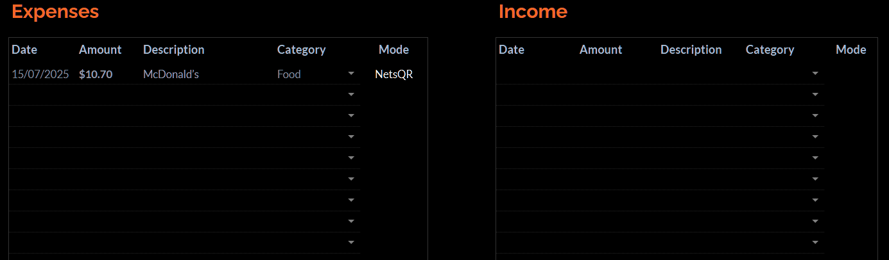

# iOS Financial Tracker

I came up with this Financial Tracker as I got tired of manually logging my daily expenses into a sheet. I thought that the best quality of life improvement would be to be able to run a logging script using the iPhone Shortcuts app. The input will be the Action button in iPhone 15 & above. This project is not documented in full; the full capability consists of it exporting each sheet at the end of each month to an annual expense tracker.


## Table of Contents

* [iOS Shortcuts](#ios-shortcuts)
* [Google Sheets (Apps Script)](#google-sheets)
* [Examples](#examples)

### iOS Shortcuts

Using the shortcuts app and a little bit of research, I came up with a script that runs when activated with the action button. 

```html
〔0〕 Text
Sharukh Khan

〔1〕 Choose from Menu
• MenuPrompt: Expense or Income:\u{space}
• MenuItems: [Expense,
Income]

〔2〕 Menu Item Expense

〔3〕 Text　»
expense

〔4〕 Set Variable expenditure to 〔3 Text〕

〔5〕 Choose from Menu
• MenuPrompt: Category:\u{space}
• MenuItems: [Transportation,
Food,
Entertainment,
Bills,
Gifts,
Personal,
Health,
Travel,
Miscellaneous\u{space}]

〔6〕 Menu Item Transportation

〔7〕 Text　»
Transportation

〔8〕 Set Variable category to 〔7 Text〕

〔9〕 Menu Item Food

〔10〕 Text　»
Food

〔11〕 Set Variable category to 〔10 Text〕

〔12〕 Menu Item Entertainment

〔13〕 Text　»
Entertainment

〔14〕 Set Variable category to 〔13 Text〕

〔15〕 Menu Item Bills

〔16〕 Text　»
Bills

〔17〕 Set Variable category to 〔16 Text〕

〔18〕 Menu Item Gifts

〔19〕 Text　»
Gifts

〔20〕 Set Variable category to 〔19 Text〕

〔21〕 Menu Item Personal

〔22〕 Text　»
Personal

〔23〕 Set Variable category to 〔22 Text〕

〔24〕 Menu Item Health

〔25〕 Text　»
Health

〔26〕 Set Variable category to 〔25 Text〕

〔27〕 Menu Item Travel

〔28〕 Text　»
Travel

〔29〕 Set Variable category to 〔28 Text〕

〔30〕 Menu Item Miscellaneous\u{space}

〔31〕 Text　»
Other

〔32〕 Set Variable category to 〔31 Text〕

〔33〕 End Menu

〔34〕 Menu Item Income　▵2

〔35〕 Text　»
income

〔36〕 Set Variable expenditure to 〔35 Text〕

〔37〕 Choose from Menu
• MenuPrompt: Select:\u{space}
• MenuItems: [Savings,
Salary,
PayNow / Bank Transfer,
Deposit,
Bonus,
Other]

〔38〕 Menu Item Savings

〔39〕 Text　»
Savings

〔40〕 Set Variable category to 〔39 Text〕

〔41〕 Menu Item Salary

〔42〕 Text　»
Salary

〔43〕 Set Variable category to 〔42 Text〕

〔44〕 Menu Item PayNow / Bank Transfer

〔45〕 Text　»
PayNow

〔46〕 Set Variable category to 〔45 Text〕

〔47〕 Menu Item Deposit

〔48〕 Text　»

〔49〕 Set Variable category to 〔48 Text〕

〔50〕 Menu Item Bonus

〔51〕 Text　»
Bonus

〔52〕 Set Variable category to 〔51 Text〕

〔53〕 Menu Item Other

〔54〕 Text　»
Other

〔55〕 Set Variable category to 〔54 Text〕

〔56〕 End Menu

〔57〕 End Menu　▵34

〔58〕 Ask for Number Input　»
• AskActionAllowsNegativeNumbers: false
• AskActionPrompt: Amount?

〔59〕 Set Variable amount to 〔58 Ask for Input〕

〔60〕 If 〔expenditure〕 is income

〔61〕 If Any are true　〔category〕 is Savings　〔category〕 is Salary　〔category〕 is Bonus

〔62〕 Text　»
Bank%20Transfer

〔63〕 Set Variable account to 〔62 Text〕

〔64〕 End If

〔65〕 If 〔category〕 is PayNow

〔66〕 Text　»
PayNow

〔67〕 Set Variable account to 〔66 Text〕

〔68〕 End If

〔69〕 If 〔category〕 is Deposit

〔70〕 Text　»
Cash

〔71〕 Set Variable account to 〔70 Text〕

〔72〕 End If

〔73〕 If 〔category〕 is Other

〔74〕 Choose from Menu
• MenuPrompt: Mode:\u{space}
• MenuItems: [PayNow,
Bank Transfer,
Cash]

〔75〕 Menu Item PayNow

〔76〕 Text　»
PayNow

〔77〕 Set Variable account to 〔76 Text〕

〔78〕 Menu Item Bank Transfer

〔79〕 Text　»
Bank Transfer

〔80〕 Set Variable account to 〔79 Text〕

〔81〕 Menu Item Cash

〔82〕 Text　»
Cash

〔83〕 Set Variable account to 〔82 Text〕

〔84〕 End Menu

〔85〕 End If　▵73

〔86〕 Otherwise　▵60

〔87〕 Choose from Menu
• MenuPrompt: Payment Mode:\u{space}
• MenuItems: [NetsQR,
PayNow,
Visa,
Cash]

〔88〕 Menu Item NetsQR

〔89〕 Text　»
NetsQR

〔90〕 Set Variable account to 〔89 Text〕

〔91〕 Menu Item PayNow

〔92〕 Text　»
PayNow

〔93〕 Set Variable account to 〔92 Text〕

〔94〕 Menu Item Visa

〔95〕 Text　»
Visa

〔96〕 Set Variable account to 〔95 Text〕

〔97〕 Menu Item Cash

〔98〕 Text　»
Cash

〔99〕 Set Variable account to 〔98 Text〕

〔100〕 End Menu

〔101〕 End If　▵86

〔102〕 Ask for Text Input　»
• AskActionPrompt: Description:\u{space}
• AskActionDefaultAnswer: 

〔103〕 Get Text from 〔102 Ask for Input〕　»

〔104〕 URL Encode 〔103 Text〕　»

〔105〕 Set Variable detail to 〔104 URL Encoded Text〕

〔106〕 Text　»
REDACTED ON PURPOSE

〔107〕 Set Variable webappid to 〔106 Text〕

〔108〕 Text　»
https://script.google.com/macros/s/〔webappid〕/exec?amount=〔amount as Text〕&expenditure=〔expenditure〕&account=〔account as Text〕&category=〔category as Text〕&detail=〔detail〕

〔109〕 Get URLs from 〔108 Text〕　»

〔110〕 Get Contents of URL 〔109 URLs〕　»
• Advanced: true
• HTTPHeaders: {}
• ShowHeaders: true
• HTTPMethod: GET

〔111〕 Show Result
〔110 Contents of URL〕

〔112〕 Vibrate Device
• VibrateHapticType: Up Direction
```

### Google Sheets

Next, we write an Apps Script that will handle the data passed to the API. 

```js
var spreadsheet = SpreadsheetApp.openById("REDACTED ON PURPOSE");

function doGet(e) {
  try {
    var amount = e.parameters.amount[0]; 
    var mode = e.parameters.expenditure[0].toLowerCase();
    var account = e.parameters.account[0];
    var category = e.parameters.category[0];
    var detail = e.parameters.detail[0];
    var now = new Date();
    var date = Utilities.formatDate(now, "GMT+8", "dd/MM/yyyy");

    var sheetName = "Transactions";
    var sheet = spreadsheet.getSheetByName(sheetName);
    if (!sheet) {
      throw new Error("Sheet not found");
    }

    var startRow = 5;
    var rowToWrite;


    function findFirstEmptyRow(sheet, startRow, column) {
    var lastRow = sheet.getLastRow();
    if (lastRow < startRow) {
      return startRow;
    }
    var numRows = lastRow - startRow + 1;
    var values = sheet.getRange(startRow, column, numRows, 1).getValues();

    for (var i = 0; i < values.length; i++) {
      if (!values[i][0]) { // empty cell found
        return startRow + i;
      }
    }
    return lastRow + 1;
    }

    if (mode === "expense") {
      rowToWrite = findFirstEmptyRow(sheet, startRow, 2); // Column B = 2
      sheet.getRange(rowToWrite, 2, 1, 5).setValues([[date, amount, detail, category, account]]);
      return ContentService.createTextOutput("Success! Expense row added.");
    } else if (mode === "income") {
      rowToWrite = findFirstEmptyRow(sheet, startRow, 8); // Column H = 8
      sheet.getRange(rowToWrite, 8, 1, 5).setValues([[date, amount, detail, category, account]]);
      return ContentService.createTextOutput("Success! Income row added.");
    } else {
      return ContentService.createTextOutput("Mode not handled: " + mode);
    }

  } catch (error) {
    Logger.log(error);
    return ContentService.createTextOutput("Error: " + error.message);
  }
}
```

### Examples




We can see that 
